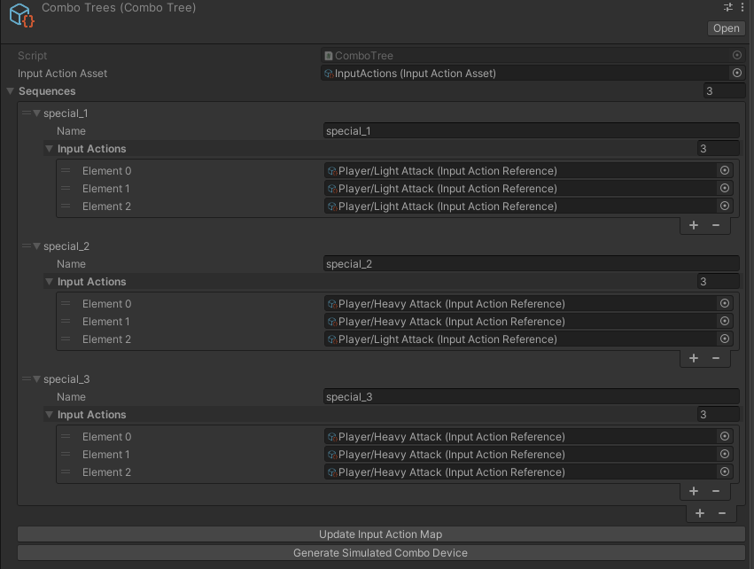
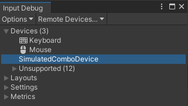

# Input System Combo Tree

Trigger an input action (through the input system) based on a sequence of inputs `Up, Up, Down, Down, Left, Right, Left, Right`

This repo demonstrates how to define custom input actions for combos/sequences of inputs.

## Getting started

### Prerequisites

You'll need to make sure to have the Input System package installed. Follow the [Unity guide](https://docs.unity3d.com/Packages/com.unity.inputsystem@1.4/manual/Installation.html) for installation instructions.

Note this was tested using Unity 2022.1.20f1 and Input System v1.4.4.

### Step 1 - Create an input action asset

This is based on your own project requirements. Follow the [Unity Quick Start Guide](https://docs.unity3d.com/Packages/com.unity.inputsystem@1.4/manual/QuickStartGuide.html) for help with this

### Step 2 - Add Combo Tree scripts to your project

Add these scripts to your project.
1. `ComboTree.cs`
1. `ComboTreeInput.cs`

### Step 3 - Create a Combo Tree asset

Create a `ComboTree` scriptable object. `Assets > Create > ScriptableObjects > ComboTree`

This is where you'll define the custom action names and sequences of input actions that are required to trigger said action.

Make sure to set the `Input Action Asset` field.

### Step 4 - Define your input sequences

Add your custom sequences.

In this project you'll find an example of this here [`Assets/ComboTrees.asset`](./Assets/ComboTrees.asset)

### Step 5 - Update the Input Action Asset

Press the `Update Input Action Map` button. This will create a new Input Action Map called `Combos` in your input action asset.

Any time you add a new sequence, make sure to press the `Update Input Action Map` button to keep your input actions up-to-date. 

### Step 6 - Generate Simulated Combo Device

Press the `Generate Simulated Combo Device` button. This will generate a C# file called `SimulatedComboDevice.cs` based on your sequences

Any time you add a new sequence, make sure to press the `Generate Simulated Combo Device` button to keep the simulated device up-to-date. 

### Step 7 - Confirm the Simulated Combo Device is registered

In the menu bar navigate to `Window > Analysis > Input Debugger`. You should see a device called `SimulatedComboDevice`

If you do not see the device, in the menu bar navigate to `Tools > Combo Input System > Create Device`.

### Step 8 - Add a ComboTreeInput component to an object in the scene

The `ComboTreeInput` component tracks all relevant input action events defined in the `ComboTree` asset. It detects when a sequence has been input and triggers the custom sequence input action. 

In this project you'll find an example of this here [`Assets/PlayerComboInput.prefab`](./Assets/PlayerComboInput.prefab)

### Done!

You should now have everything in place. Take a look at the sample scene in this project for a basic example of how to set this up.

## Known Issues and Limitations

1. The `Update Input Action Map` button will not remove stale/old input actions that no longer exist in the `ComboTree` asset. If you remove a sequence from your `ComboTree` asset you may have to remove it manually from the input action asset. Keeping it shouldn't affect any other sequences though.
1. The generated device only works for one player at the moment.
1. This is strictly an Input System extension and does not consider animations or animation state.
1. The `ComboTreeInput` script does not handle sequences of sequences at this time. In theory it can be modified to do so.